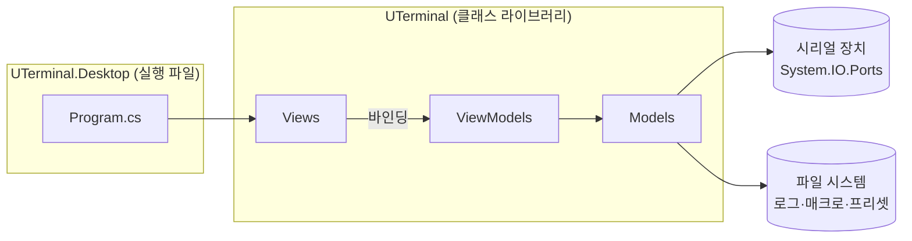
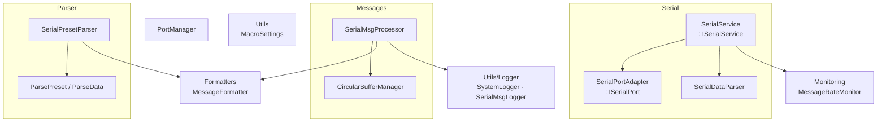
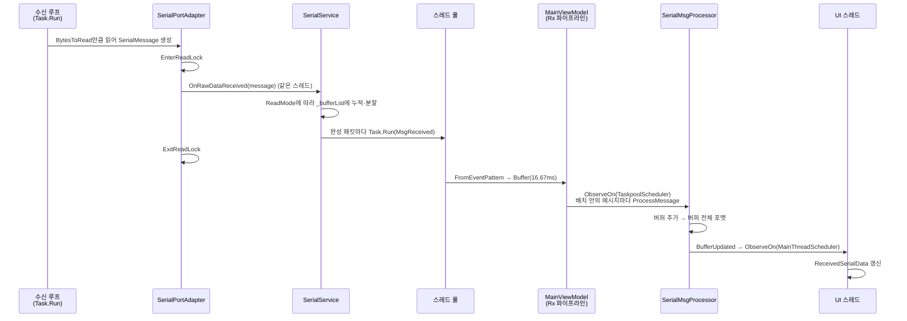
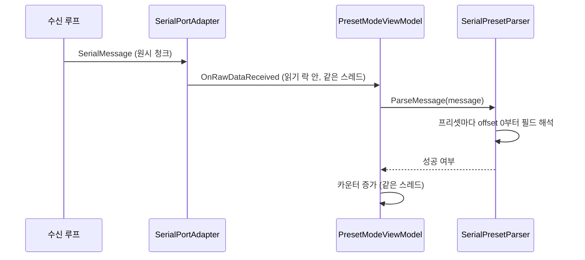

# UTerminal 아키텍처

> 이 문서는 arc42(© Gernot Starke, Peter Hruschka, CC BY-SA 4.0: https://creativecommons.org/licenses/by-sa/4.0/) 템플릿의 섹션 구조를 따른다.
>
> 1(소개 및 목표), 5(빌딩 블록 뷰), 6(런타임 뷰), 8(횡단 개념), 9(아키텍처 결정) 섹션만 작성한다. 나머지 섹션은 이 프로젝트 규모에서 채울 내용이 없어 생략한다.
>
> 본문의 `경로:라인` 표기는 서술 근거가 되는 코드 위치다. 코드를 바꾸면 이 문서의 해당 부분도 함께 확인한다.

---

## 1. 소개 및 목표

### 1.1 요구사항 개요

UTerminal은 UART 시리얼 장치와 데이터를 주고받으며 모니터링하는 데스크톱 앱이다. Windows·macOS·Linux를 하나의 코드베이스로 지원한다.

| 기능 | 내용 | 진입점 |
|---|---|---|
| 포트 연결 | 포트·Baudrate·Parity·DataBits·StopBits 설정 후 연결 | `MainViewModel.ConnectSerialPort` (`UTerminal/ViewModels/MainViewModel.cs:240`) |
| 수신 표시 | ASCII / HEX / UTF-8 중 선택한 인코딩으로 표시 | `SerialMsgProcessor.ChangeFormat` (`UTerminal/Models/Messages/SerialMsgProcessor.cs:66`) |
| 패킷 구분 | NewLine, STX-ETX, Custom STX-ETX 세 가지 읽기 방식 | `SerialService.OnRawDataReceived` (`UTerminal/Models/Serial/SerialService.cs:95`) |
| 송신 | 문자열 또는 `$XX` 형식 HEX 송신 | `SerialDataParser.ParseToBytes` (`UTerminal/Models/Serial/SerialDataParser.cs:14`) |
| 매크로 | 미리 저장한 문자열 10개를 버튼으로 송신 | `MacroViewModel` (`UTerminal/ViewModels/MacroViewModel.cs:29`) |
| 로깅 | 시스템 로그(항상), 수신 데이터 로그(사용자가 켤 때) | `SystemLogger`, `SerialMsgLogger` |
| 프리셋 모드 | 사용자가 정의한 필드 구조로 바이너리 패킷을 파싱해 필드별 값 표시 | `PresetModeViewModel` (`UTerminal/ViewModels/PresetModeViewModel.cs:154`) |

사용 방법은 `README.md`에 있다.

### 1.2 품질 목표

UTerminal은 기존 `Terminal` 프로그램에서 겪은 문제를 고치고, 운영체제와 관계없이 쓰기 위해 만들었다(`README.md:13-15`). 품질 목표도 이 동기를 따른다. 수치 기준은 아직 정하지 않았다.

| 순위 | 품질 목표 | 구체적 의미 | 근거 |
|---|---|---|---|
| 1 | 안정성 | 고속 수신이나 장시간 누적에도 성능이 떨어지거나 멈추지 않는다 | `README.md:13` "고속 데이터 처리나 대용량 데이터가 누적될 때 성능 저하 문제가 발생" |
| 2 | 크로스플랫폼 | 같은 코드로 Windows / macOS(x64, arm64) / Linux(x64, arm64)를 빌드·실행한다 | `README.md:15`, `.github/workflows/dotnet-build.yaml` |
| 3 | 사용 용이성 | 하드웨어 통신을 다루는 사용자가 불편 없이 연결·모니터링·송신한다 | `README.md:15` "실제 사용자로서 경험했던 불편함", "모든 사용자가 편리하게 사용할 수 있도록" |

### 1.3 이해관계자

| 역할 | 관심사 |
|---|---|
| 유지보수자 | 장기 유지보수, 구조의 일관성 |
| 기여자(예정) | 어디를 고쳐야 하는지, 지켜야 할 규칙이 무엇인지 |
| 사용자 | 하드웨어 통신을 디버깅하는 개발자. 안정적인 수신 표시와 패킷 파싱 |

---

## 5. 빌딩 블록 뷰

### 5.1 레벨 1 — 전체 시스템

| 블록 | 책임 | 위치 |
|---|---|---|
| UTerminal.Desktop | Avalonia 앱 빌더 구성과 실행. 플랫폼별 Release 배포 설정 | `UTerminal.Desktop/Program.cs`, `UTerminal.Desktop/UTerminal.Desktop.csproj` |
| Views | Avalonia XAML 화면. 메인 창, 프리셋 모드 창, 매크로 창 | `UTerminal/Views/` |
| ViewModels | 화면 상태와 커맨드. 모델 객체를 생성하고 연결 | `UTerminal/ViewModels/` |
| Models | 시리얼 I/O, 패킷 구분, 버퍼링, 포맷, 파싱, 로깅 | `UTerminal/Models/` |
| Behaviors / Converter / Styles | XAML 보조 요소(AvaloniaEdit 바인딩, 값 변환, 공용 스타일) | `UTerminal/Behaviors/`, `UTerminal/Converter/`, `UTerminal/Styles/` |

분해 기준은 MVVM 계층이다. 실행 파일 프로젝트는 진입점만 갖고, 화면과 로직은 모두 라이브러리에 있다.

**객체 조립**: DI 컨테이너는 없다. `App`이 `MainViewModel`을 만들고(`UTerminal/App.axaml.cs:20-23`), `MainViewModel` 생성자가 모델 객체 그래프를 직접 만든다(`MainViewModel.cs:74-81`). 프리셋 모드·매크로 창의 ViewModel도 `MainViewModel`이 만들면서 필요한 객체를 넘긴다(`MainViewModel.cs:356-359`, `MainViewModel.cs:433-436`).

### 5.2 레벨 2 — Models

| 블록 | 책임 | 인터페이스 | 위치 |
|---|---|---|---|
| **SerialPortAdapter** | `System.IO.Ports.SerialPort`를 감싼다. 연결·해제·송신, 수신 루프, 원시 데이터 구독자 관리 | `ISerialPort` | `UTerminal/Models/Serial/SerialPortAdapter.cs` |
| **SerialService** | 원시 데이터를 읽기 방식(`ReadModeType`)에 따라 패킷으로 나눠 `MsgReceived` 이벤트로 발행. 송신 문자열을 바이트로 변환. 수신 속도 집계 | `ISerialService` | `UTerminal/Models/Serial/SerialService.cs` |
| SerialConnectionConfiguration / SerialRuntimeConfiguration | 연결 설정과 실행 중 설정. `ReactiveObject`라서 UI 바인딩 대상 | — | `UTerminal/Models/Serial/SerialConfiguration.cs` |
| **SerialMsgProcessor** | 패킷을 순환 버퍼에 쌓고, 버퍼 전체를 현재 인코딩으로 포맷해 `BufferUpdated` 이벤트로 발행. 수신 로그 기록 | `IMessageProcessor<ISerialMessage>` | `UTerminal/Models/Messages/SerialMsgProcessor.cs` |
| CircularBufferManager | 최근 N개 메시지만 보관하는 순환 버퍼. `lock`으로 보호 | `IBufferManager<ISerialMessage>` | `UTerminal/Models/Messages/CircularBufferManager.cs` |
| MessageFormatter | 바이트 → ASCII/HEX/UTF-8 문자열, 타임스탬프 결합 | — | `UTerminal/Models/Formatters/MessageFormatter.cs` |
| **SerialPresetParser** | 등록된 프리셋마다 바이트 배열을 필드 단위로 해석해 `ParseData.ParsedValue`를 갱신 | `ISerialPresetParser` | `UTerminal/Models/Parser/SerialPresetParser.cs` |
| ParsePreset / ParseData | 프리셋(필드 목록)과 필드 정의. 필드 크기는 타입으로 정해진다(`ParseData.cs:68-86`) | `IParsePreset`, `IParseData` | `UTerminal/Models/Parser/` |
| MessageRateMonitor | 1초 단위 수신 빈도(Hz) 계산 | `IMessageRateMonitor` | `UTerminal/Models/Monitoring/MessageRateMonitor.cs` |
| PortManager | 시스템 포트 목록 조회와 선택 | — | `UTerminal/Models/PortManager/PortManager.cs` |
| SystemLogger / SerialMsgLogger | log4net 기반 싱글턴 로거 | — | `UTerminal/Models/Utils/Logger/` |
| MacroSettings | 매크로 목록 JSON 로드·저장 | `ISettingsManager<MacroItems[]>` | `UTerminal/Models/Utils/MacroSettings.cs` |

인터페이스(`ISerialPort`, `ISerialService`, `IBufferManager` 등)는 모두 구현체가 하나다.

#### 블록별 알려진 문제

현재 코드에 있는 동작이다. 수정 전까지는 이 동작을 전제로 작업한다.

- **SerialPortAdapter 수신 루프**: `StartReading`은 `BytesToRead`가 0일 때도 대기 없이 곧바로 다음 반복으로 넘어간다(`SerialPortAdapter.cs:173-193`). 연결 중에는 데이터가 없어도 루프가 계속 돈다.
- **SerialPresetParser 가변 길이 필드**: 길이 필드 값을 `(byte)`로 unboxing한다(`SerialPresetParser.cs:110`). 그런데 UI는 길이 필드 타입으로 UInt8·UInt16·UInt32를 제공한다(`PresetModeViewModel.cs:116-121`). UInt16·UInt32를 고르면 `ParsedValue`가 boxed `ushort`/`uint`라서 캐스트가 `InvalidCastException`을 던진다. 이 예외는 `catch (Exception) { return false; }`(`SerialPresetParser.cs:141`)에 잡혀 파싱 실패로만 집계된다. 실제로 동작하는 길이 필드 타입은 UInt8뿐이다.
- **가변 길이 필드의 경계 검사**: 가변 필드는 `ParseDataType.Byte`, `length: 0`으로 만들어져 `Size`가 0이다(`PresetModeViewModel.cs:236`, `ParseData.cs:76`). 그래서 `offset + parseData.Size > data.Length` 검사(`SerialPresetParser.cs:106`)는 실제 길이를 보지 않는다. 길이가 데이터를 넘으면 `AsSpan`에서 예외가 나고 위와 같이 실패로 처리된다.
- **ParsePreset 길이 캐시**: `_cachedLength`는 `RemoveItem`에서만 무효화된다(`ParsePreset.cs:95-99`). `AddField`(`PresetModeViewModel.cs:232`)와 `ClearFields`(`PresetModeViewModel.cs:253`)는 `ParseDataList`를 직접 바꾸면서 캐시를 무효화하지 않는다. 한 번 파싱한 뒤 필드를 추가하면 길이 사전 검사(`SerialPresetParser.cs:81`)가 옛 길이를 쓴다.
- **사용하지 않는 코드**: `SerialPresetParser.GetTotalLength()`와 `_cachedTotalLength`(`SerialPresetParser.cs:22`, `47-62`)는 호출하는 곳이 없다.

---

## 6. 런타임 뷰

### 6.1 기본 모드 수신

1. **연결**: `SerialService.Connect`가 `ISerialPort.Open`을 호출하고, 성공하면 원시 데이터를 구독한다(`SerialService.cs:59-64`). `Open`은 수신 루프를 `Task.Run`으로 시작한다(`SerialPortAdapter.cs:119-120`).
2. **원시 수신**: 루프는 그 시점의 `BytesToRead`만큼 읽어 `SerialMessage` 하나를 만든다(`SerialPortAdapter.cs:175-188`). 이 단위는 OS 버퍼에 쌓인 양이라서 패킷 경계와 무관하다.
3. **브로드캐스트**: `BroadcastRawData`는 읽기 락을 잡은 채로 구독자를 **수신 루프 스레드에서 동기 호출**한다(`SerialPortAdapter.cs:210-228`).
4. **패킷 구분**: `SerialService.OnRawDataReceived`가 `ReadMode`에 따라 바이트를 `_bufferList`에 모은다(`SerialService.cs:95-111`).
   - `NewLine`: LF(0x0A)에서 패킷을 끝낸다. 바로 앞 바이트가 CR(0x0D)이면 지운다(`SerialService.cs:120-125`). 그래서 CR+LF와 LF 단독 모두 구분자로 동작한다. CR 단독은 구분자가 아니다.
   - `StxEtx` / `Custom`: STX를 만나면 수집을 시작하고, ETX를 만났을 때 누적 길이가 `PacketSize` 이상이면 패킷을 끝낸다(`SerialService.cs:160-185`). 수집 중에 STX가 다시 오면 기존 바이트를 버리지 않고 이어서 붙인다(`SerialService.cs:160-165`).
5. **이벤트 발행**: 완성 패킷마다, 구독자마다 `Task.Run`으로 `MsgReceived`를 호출한다(`SerialService.cs:197-210`). 각 호출은 스레드 풀에서 따로 실행된다.
6. **배치**: `MainViewModel`은 이벤트를 16.67ms 단위로 묶고 스레드 풀에서 `ProcessMessages`를 실행한다(`MainViewModel.cs:105-109`).
7. **버퍼·포맷**: `ProcessMessages`는 배치 안의 메시지마다 `SerialMsgProcessor.ProcessMessage`를 호출한다(`MainViewModel.cs:134-139`). `ProcessMessage`는 호출될 때마다 순환 버퍼 전체(용량 1024, `MainViewModel.cs:81`)를 다시 포맷해 `BufferUpdated`를 발생시킨다(`SerialMsgProcessor.cs:30-52`). 배치 하나에 메시지가 N개면 전체 포맷과 UI 갱신 예약도 N번 일어난다. `Buffer`는 처리 시점을 묶을 뿐 UI 갱신 횟수를 줄이지 않는다.
8. **UI 반영**: `BufferUpdated`는 `MainThreadScheduler`로 넘어가 `ReceivedSerialData`를 바꾼다(`MainViewModel.cs:112-116`).
9. **해제**: `Disconnect`는 구독을 해지하고 `_bufferList`를 비운 뒤 포트를 닫는다(`SerialService.cs:69-80`). `Close`는 수신 루프의 토큰을 취소한다(`SerialPortAdapter.cs:139-140`).

### 6.2 프리셋 모드 수신

1. `StartParsing`은 `ISerialPort.SubscribeRawData`로 원시 데이터를 직접 구독한다(`PresetModeViewModel.cs:271`). `SerialService`의 패킷 구분을 거치지 않는다.
2. 파서에는 6.1의 2단계에서 만든 **원시 청크**가 그대로 들어간다. 파서는 각 프리셋을 청크의 offset 0부터 해석한다(`SerialPresetParser.cs:98-104`). 패킷 하나가 청크 두 개로 나뉘거나 청크 하나에 여러 패킷이 들어 있으면, 청크 시작이 패킷 시작과 맞지 않아 파싱이 실패한다.
3. `ParseData.ParsedValue`와 `TotalReceivedCount` 등 UI에 바인딩된 속성은 수신 루프 스레드에서 바로 갱신된다(`PresetModeViewModel.cs:341-355`, `SerialPresetParser.cs:111`). `MainThreadScheduler`를 거치지 않는다.

### 6.3 송신

1. 입력 문자열은 `SerialService.WriteAsync` → `SerialDataParser.ParseToBytes`로 바이트가 된다(`SerialService.cs:82-87`).
2. 공백으로 나눈 **모든** 토큰이 `$XX`(16진 2자리) 형식이면 HEX 바이트로, 하나라도 아니면 문자열 전체를 UTF-8로 변환한다(`SerialDataParser.cs:17-28`).
3. `SerialPortAdapter.WriteAsync`가 `BaseStream.WriteAsync`로 보낸다(`SerialPortAdapter.cs:148-163`).

매크로 창은 `MainViewModel.SendSerialDataCommand`를 그대로 받아 쓰므로 같은 경로를 탄다(`MainViewModel.cs:358`).

---

## 8. 횡단 개념

### 8.1 스레드 모델

| 스레드 | 실행 내용 | 시작 위치 |
|---|---|---|
| UI 스레드 | Avalonia 렌더링, 커맨드, `MainThreadScheduler` 작업 | — |
| 수신 루프 | `StartReading`, `BroadcastRawData`, 모든 원시 구독자(`SerialService.OnRawDataReceived`, `PresetModeViewModel.OnRawDataReceived`) | `SerialPortAdapter.cs:120` |
| 스레드 풀 | `MsgReceived` 핸들러 호출, `TaskpoolScheduler` 위의 `ProcessMessages` | `SerialService.cs:208`, `MainViewModel.cs:108` |

**규칙**

- UI에 바인딩된 속성은 UI 스레드에서 바꾼다. 백그라운드 결과는 `ObserveOn(RxApp.MainThreadScheduler)`로 넘긴다. 예: `MainViewModel.cs:115`.
- 원시 구독자는 수신 루프 스레드를 막는다. 구독자 안에서 오래 걸리는 작업을 하면 다음 읽기가 그만큼 늦어진다.

**현재 규칙과 다른 곳**: 프리셋 모드는 UI 바인딩 속성을 수신 루프 스레드에서 바꾼다(6.2의 3단계). Avalonia가 이 경우 어떻게 동작하는지는 확인하지 않았다.

**순서 보장 없음**: `MsgReceived`를 메시지마다 `Task.Run`으로 따로 실행하므로(`SerialService.cs:205-209`) 핸들러가 호출되는 순서는 패킷 도착 순서와 다를 수 있다. 그 결과 여러 스레드가 동시에 Rx 파이프라인(`FromEventPattern` → `Buffer`)으로 값을 넣을 수 있다. Rx 연산자는 동시 `OnNext` 호출을 전제하지 않는데, 이것이 실제로 문제를 일으키는지는 확인하지 않았다(추론).

### 8.2 원시 데이터 구독과 락

`SerialPortAdapter`는 구독자를 배열로 관리한다(`SerialPortAdapter.cs:21-23`).

- **구독·해지**: 쓰기 락 안에서 새 배열을 만들어 교체한다(`SerialPortAdapter.cs:51-89`). 해지 수단은 `IDisposable`(`Subscription`)이다.
- **브로드캐스트**: 읽기 락을 잡은 채로 구독자를 호출한다(`SerialPortAdapter.cs:212-227`). 배열을 교체 방식으로 바꾸지만 읽기 쪽도 락을 잡으므로 lock-free 읽기는 아니다.

**주의**: 구독자 안에서 구독을 해지하면 안 된다. 같은 스레드가 읽기 락을 쥔 상태에서 `UnsubscribeRawData`의 `EnterWriteLock`을 호출하게 된다. `ReaderWriterLockSlim`은 재귀 정책과 관계없이 읽기 모드로 들어온 스레드가 쓰기 모드로 올라가는 것을 허용하지 않는다. 출처: https://learn.microsoft.com/en-us/dotnet/api/system.threading.readerwriterlockslim.-ctor ("Regardless of recursion policy, a thread that initially entered read mode is not allowed to upgrade to upgradeable mode or write mode"). 이 경우 `LockRecursionException`이 나고, 수신 루프의 `catch (Exception e)`(`SerialPortAdapter.cs:200-203`)에서 루프가 끝난다.

구독자 관리 방식을 바꿀 때는 이 락 패턴을 함께 유지한다(`CLAUDE.md` 주의 사항).

### 8.3 설정 모델

| 클래스 | 항목 | 적용 시점 |
|---|---|---|
| `SerialConnectionConfiguration` | PortName, BaudRate, Parity, DataBits, StopBits | 연결되어 있지 않을 때만 포트에 반영(`SerialPortAdapter.cs:94-104`). 연결 중 변경은 다음 연결부터 적용 |
| `SerialRuntimeConfiguration` | ReadMode, CustomStx, CustomEtx, PacketSize | 원시 청크를 처리할 때마다 읽으므로 즉시 반영(`SerialService.cs:98`, `154`) |

연결 중에 `ReadMode`를 바꾸면 `_bufferList`에 남아 있던 바이트는 새 방식으로 이어서 처리된다. 비우는 곳은 `Disconnect`와 패킷 완성 시점뿐이다(`SerialService.cs:76`, `193`).

### 8.4 로깅

| 로거 | 용도 | 파일 위치 |
|---|---|---|
| `SystemLogger.Instance` | 앱 동작·오류 | `<ApplicationData>/<App.Name>/<App.Name>-system.log`, 날짜별 롤링(`SystemLogger.cs:17-27`) |
| `SerialMsgLogger.Instance` | 수신 패킷 기록. 사용자가 켤 때만 기록 | 기본값은 실행 파일 폴더(`AppContext.BaseDirectory`, `SerialMsgLogger.cs:16`). 사용자가 폴더를 고를 수 있다(`MainViewModel.cs:411-425`). 기록을 시작할 때마다 `DataReceived-yyyyMMdd HHmmss.log`를 새로 만든다(`SerialMsgLogger.cs:39`) |

- 두 로거 모두 `Lazy<T>` 싱글턴이다. 새 코드도 이 인스턴스를 쓴다.
- 수신 로그는 기본 모드 경로(`SerialMsgProcessor.ProcessMessage`)에서만 기록된다(`SerialMsgProcessor.cs:35-38`). 프리셋 모드 수신은 기록되지 않는다.
- 오류는 대부분 `LogSystemError`로 남기고 `false`를 반환한다(`SerialPortAdapter.cs:124-129`, `157-162`). 사용자에게 오류 내용을 보여 주는 경로는 없다.

### 8.5 영속화

| 데이터 | 형식 | 위치 | 코드 |
|---|---|---|---|
| 매크로 목록 | JSON (`MacroItems[]`) | `<ApplicationData>/<App.Name>/macro_settings.json` | `MacroViewModel.cs:35`, `MacroSettings.cs` |
| 프리셋 | JSON (`ParsePreset`) | `<실행 파일 폴더>/Preset/<프리셋 이름>.json` | `PresetModeViewModel.cs:299-314` |

프리셋 불러오기는 파일 선택 창으로 고른 JSON을 역직렬화한다(`PresetModeViewModel.cs:319-335`).

실행 파일 폴더에 쓰는 데이터(프리셋, 수신 로그 기본 경로)는 설치 위치에 쓰기 권한이 없으면 저장되지 않을 수 있다(추론. macOS `.app`, Windows `Program Files`에서 확인하지 않았다).

### 8.6 바이너리 해석

프리셋 모드의 다중 바이트 숫자 필드(Int16~Double)는 `MemoryMarshal.Read<T>`로 읽는다(`SerialPresetParser.cs:192-196`). 이 메서드는 바이트를 그대로 `T`의 메모리 표현으로 해석한다(출처: https://learn.microsoft.com/en-us/dotnet/api/system.runtime.interopservices.memorymarshal.read, "from the raw binary contents of the source span"). 그래서 실행 환경의 바이트 순서를 따른다. CI 대상(x64, arm64)에서는 리틀 엔디언으로 해석되고, 빅 엔디언 패킷은 지원하지 않는다(추론. 문서에 바이트 순서가 직접 적혀 있지는 않다).

---

## 9. 아키텍처 결정

"이유"가 `미기록`인 항목은 코드에 결정만 드러나 있고 이유는 남아 있지 않다. 이유를 확인하면 이 표에 채운다.

| # | 결정 | 이유 | 결과 |
|---|---|---|---|
| D1 | .NET 8 + Avalonia로 단일 코드베이스 크로스플랫폼 | 운영체제와 무관하게 쓰기 위해(`README.md:15`) | 플랫폼별 배포 설정이 `UTerminal.Desktop.csproj` 한 곳에 모인다. 이 설정의 조건은 빌드 호스트 OS 기준이라 대상 플랫폼과 같은 OS에서 배포해야 한다(`CLAUDE.md` 빌드 절) |
| D2 | MVVM + ReactiveUI | 미기록 | 커맨드·속성 변경·스레드 전환을 Rx로 표현한다. 스레드 규칙(8.1)을 지키는 책임이 각 ViewModel에 있다 |
| D3 | 화면 표시용 메시지를 순환 버퍼(용량 1024)에 보관 | 대용량 누적 시 성능 저하 방지(`README.md:13`과 연결, 직접 기록은 없음) | 메모리 사용량에 상한이 생긴다. 오래된 메시지는 화면에서 사라지므로 전체 기록이 필요하면 수신 로그를 켜야 한다 |
| D4 | 수신 이벤트를 `Buffer(16.67ms)`로 묶어 처리 | 미기록. 값으로 보아 60fps 기준으로 추정 | 현재는 배치 안에서 메시지마다 전체 포맷과 UI 갱신이 일어나므로(6.1의 7단계) UI 갱신 횟수는 줄지 않는다 |
| D5 | 원시 데이터를 `SerialPortAdapter`에서 구독자 배열로 브로드캐스트 | 미기록 | 기본 모드와 프리셋 모드가 같은 포트를 동시에 구독할 수 있다. 구독자가 수신 루프 스레드와 읽기 락 안에서 실행된다(8.2) |
| D6 | 프리셋 모드는 `SerialService`의 패킷 구분을 거치지 않고 원시 청크를 파싱 | 미기록 | 패킷 경계와 청크 경계가 맞을 때만 파싱이 성공한다(6.2의 2단계) |
| D7 | DI 컨테이너 없이 `MainViewModel`이 객체를 조립 | 미기록 | 의존성이 한 생성자에 모여 있어 흐름을 따라가기 쉽다. 인터페이스는 있지만 구현체가 하나씩이고, 교체 지점은 `MainViewModel` 생성자뿐이다 |
| D8 | 프리셋을 실행 파일 폴더 아래 JSON으로 저장 | 미기록 | 프리셋 파일이 앱과 같은 위치에 있다. 쓰기 권한 문제는 8.5 참조 |
