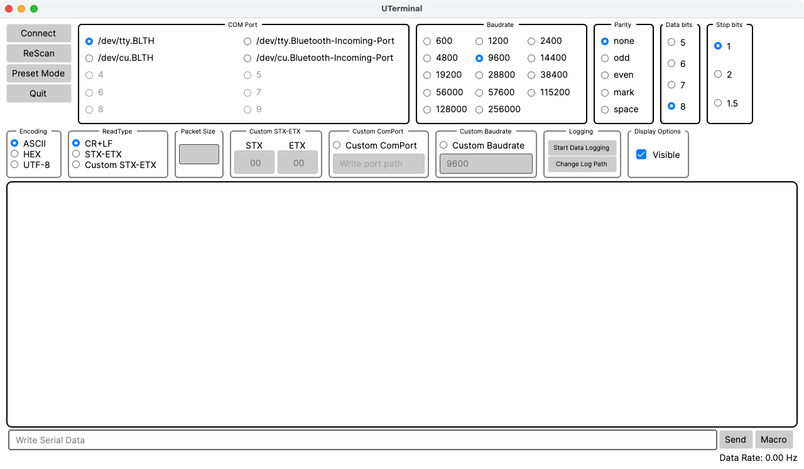
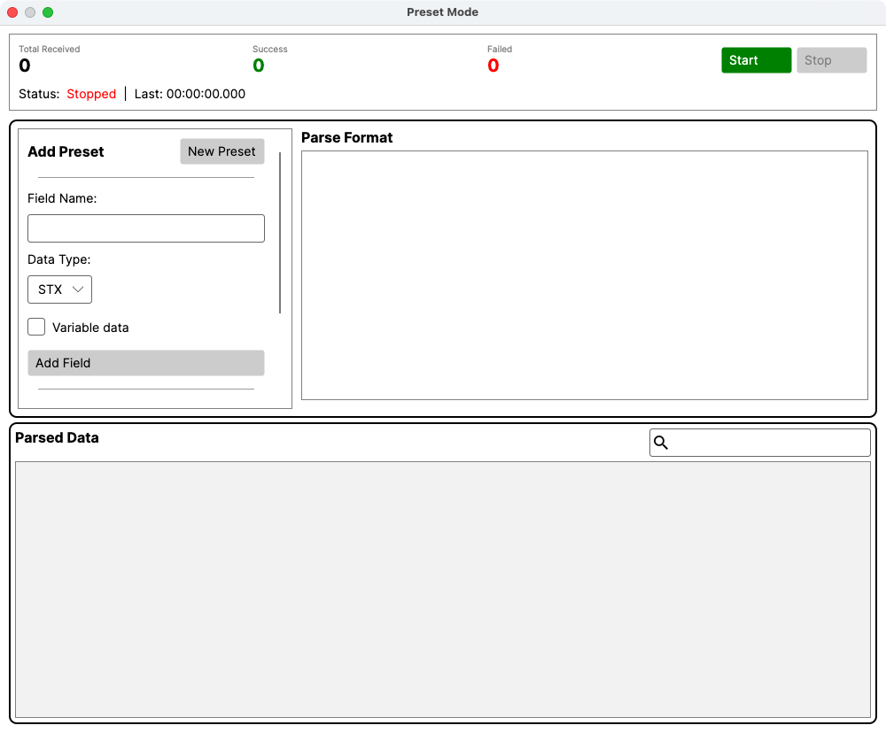

# UTerminal

Default is Korean. Chose your language:
- [English](docs/README.en.md)

---
## 소개
UTerminal은 Avaloani UI를 기반으로 한 크로스플랫폼 UART 통신 모니터링 프로그램입니다.
이 프로그램은 다양한 인코딩 타입과 커스텀 설정을 지원하여 시리얼 포트와의 통신을 보다 쉽게 관리할 수 있도록 설계되었습니다.
UTerminal을 통해 사용자는 ASCII, HEX, UTF-8 등의 인코딩 타입을 선택하고, 커스텀 ComPort 경로와 Baudrate를 설정할 수 있으며, 빠른 전송을 위한 매크로 기능도 제공됩니다.

## 개요
예전에 `Windows`에서 사용되던 `Terminal` 프로그램은 하드웨어 통신과 데이터 모니터링에 주로 활용되었습니다. 하지만 고속 데이터 처리나 대용량 데이터가 누적될 때 성능 저하 문제가 발생했고, 몇 가지 개선이 필요하다고 느꼈습니다.

이 프로그램의 실제 사용자로서 경험했던 불편함과 '이런 기능이 있었으면 좋겠다'는 생각들을 바탕으로 새로운 프로그램 개발을 시작하게 되었습니다. 특히 모든 사용자가 편리하게 사용할 수 있도록 운영체제에 구애받지 않는 크로스 플랫폼으로 개발했습니다.

현 프로그램은 `Terminal` 프로그램을 모방하여 만들었습니다.

## New Features
- 사용자 정의 프리셋을 통하여, 시리얼 데이터 파싱
  - 이름 및 각 데이터 타입하단에 데이터정보 업데이트
  - 인디케이터를 통한 데이터 파싱 성공여부 확인 기능
  - 사용자 정의 프리셋 구성 가능
  - 가변길이 패킷 파싱 기능 추가
  - 프리셋 저장 및 불러오기 기능 추가

## Features
- 시리얼 포트 장치와 연결 기능 제공
- ASCII, HEX, UTF-8 인코딩 타입 제공
- CR+LF, STX-ETX, Custom STX-ETX 읽는 방식 제공
    - 패킷 크기 설정에 따른 데이터 수신 기능 제공
    - 패킷 크기가 0 혹은 없다면, ETX가 감지되는 즉시 데이터를 반환
- 커스텀 포트 설정 및 커스텀 보레이트 설정
- 매크로 사용으로 빠른 전송 기능 제공
- 로깅 기능으로 프로그램 상태 기록 기능 제공
- 시리얼 데이터 로깅 기능 제공

---

## ***TODO*** 목록
- 시리얼 데이터를 TCP/UDP를 통해서 전송

---

# Screenshot

### 기본 화면


### 프리셋 모드 화면


---

# 사용방법

### 기본모드

#### 데이터 수신
1. 먼저 시리얼 포트를 선정하고, 그에 맞는 Baudrate, Parity, Data bits 등을 선택해줍니다.
2. Connect 버튼을 눌러 시작합니다.
3. Encoding과 ReadType을 들어오는 데이터에 맞춰서, 화면에 출력이 나오는지 확인합니다.

※ 만약 내가 찾고 있는 포트가 보이지 않으면, Rescan 버튼을 눌러 새로고침 해줍니다. <br>
※ STX/ETX를 사용한다면, 패킷크기를 설정하여, 크기만큼 받아서 모니터링할 수 있습니다.

#### 데이터 송신
1. 화면 하단의 Input에 원하는 데이터를 입력합니다.
2. Enter키 혹은 Send 버튼을 통해서 데이터를 전송합니다.

#### 헥스 데이터 전송 방법
**$** 표시를 앞에 붙여서 헥스데이터를 만들 수 있습니다.

예시)
- $01 → 0x01
- $FF → 0xFF

※ 메인화면의 Input과 Macro Window의 Input에서 모두 적용이 됩니다.


### 사용자 정의 프리셋 모드
1. 먼저 시리얼 포트를 연결합니다.
2. `Preset Mode`를 눌러, 새로운 창으로 진입합니다.
3. 탭 상단의 `New Preset`을 눌러 새로운 프리셋을 추가합니다.
    - 하단의 프리셋이 선택되어있어야 필드를 추가할 수 있습니다.
4. 좌측의 프리셋 탭에서 먼저 필드를 추가해줍니다.
   1. 필드 이름 설정
   2. 필드의 데이터 타입 설정
5. 상단의 `Start`버튼을 통해 파싱을 시작합니다. 

※ 프리셋을 저장하고 불러오기 가능

<br>

#### Variable data (가변길이 데이터 파싱)
1. `Variable data`를 체크하여 활성화
2. DataType에서 가변길이의 길이 데이터 크기를 설정
   - ex) 길이 데이터의 타입이 8바이트라면 Uint8로 설정 
3. 한쌍의 데이터가 추가 된것을 확인

※ 데이터는 Byte로 그 길이만큼 파싱합니다. <br>
※ 데이터 길이가 들어오는 순서 변경 가능 <br>
※ 데이터 길이는 어떤 데이터 필드와 연결되어있는지 이름으로 확인 가능

---

# 빌드

## 요구사항

- Dotnet 8 or higher
- [Avalonia UI](https://github.com/AvaloniaUI/Avalonia) 11.x.x
- [AvaloniaEdit](https://github.com/AvaloniaUI/AvaloniaEdit) 11.1.0
- [Avalonia.Xaml.Behaviors](https://github.com/wieslawsoltes/Avalonia.Xaml.Behaviors) 11.2.0.x
- [log4net](https://github.com/apache/logging-log4net) 3.0.3


## 배포

각 플랫폼별로 배포가 가능합니다.

원하는 플랫폼에 맞추어서 빌드를 다음과 같이 진행하면 됩니다.

**Note:** 
현재 arm64의 경우에는 빌드는 가능하나 테스트가 되지 않아 실행여부 확인이 어렵습니다.

#### Windows
```shell
dotnet publish -c Release -r win-x64
```

#### MacOS
```shell
# If it is the M series, you can publish it as osx-arm64(not tested)
dotnet publish -c Release -r osx-x64
```

#### Linux
```shell
# If use arm, you can publish it as linux-arm(not tested)
dotnet publish -c Release -r linux-x64
```

---

## 라이센스

[LICENSE](LICENSE)