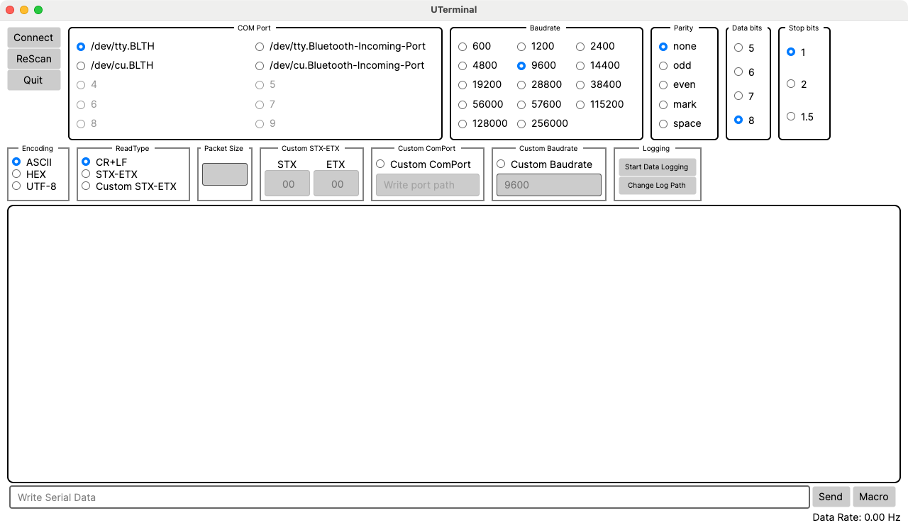

# UTerminal
## Intro

### Korean
UTerminal은 Avalonia UI를 기반으로 한 크로스플랫폼 UART 통신 모니터링 프로그램입니다.
이 프로그램은 다양한 인코딩 타입과 커스텀 설정을 지원하여 시리얼 포트와의 통신을 보다 쉽게 관리할 수 있도록 설계되었습니다.
UTerminal을 통해 사용자는 ASCII, HEX, UTF-8 등의 인코딩 타입을 선택하고, 커스텀 ComPort 경로와 Baudrate를 설정할 수 있으며, 빠른 전송을 위한 매크로 기능도 제공됩니다.

### English
UTerminal is a cross-platform UART communication monitoring program based on Avalonia UI.
This program is designed to make serial port communication easier to manage by supporting various encoding types and custom settings.
Through UTerminal, users can select encoding types such as ASCII, HEX, and UTF-8, set custom ComPort paths and Baudrates, and access macro functionality for quick data transmission.

# Features

- Connect serial port
- ASCII, HEX, UTF-8 Encoding Types
- CR+LF, STX-ETX, Custom STX-ETX Read Type
  - Parse with packet size.
  - If packet size set to 0 or empty, parse and return packet data when ETX is detected
- Custom ComPort Path, Custom Baudrate
- Macros for fast transfers


# Screenshot




# User Guide

## Receiving Data
1. Select your serial port and communication settings.
2. Click [Connect] button to start communication.

※ If ports are not visible, click [Rescan] button to refresh.
※ When using STX/ETX protocol, you can set packet size for parsing

## Sending Data
1. Enter data in the input box at the bottom of the screen.
2. Press Enter key or click [Send] button to transmit data.

### How to Input Hexadecimal Data
You can input hex data by prefixing with $ symbol in both sending box and macro window.

Example)
- $01 → 0x01
- $FF → 0xFF

※ This hex input method can also be used in the macro window.

# Build

## Requirements

- Dotnet 8 or higher
- Avalonia UI 11.x.x
- [AvaloniaEdit](https://github.com/AvaloniaUI/AvaloniaEdit) 11.1.0
- [Avalonia.Xaml.Behaviors](https://github.com/wieslawsoltes/Avalonia.Xaml.Behaviors) 11.2.0.x


## Release

The project file is set to match the runtime of each platform.
You can build it according to the platform runtime as follows.

#### Windows
```shell
dotnet publish -c Release -r win-x64
```

#### MacOS
```shell
# If it is the M series, you can publish it as osx-arm64(not tested)
dotnet publish -c Release -r osx-x64
```

#### Linux
```shell
# If use arm, you can publish it as linux-arm(not tested)
dotnet publish -c Release -r linux-x64
```